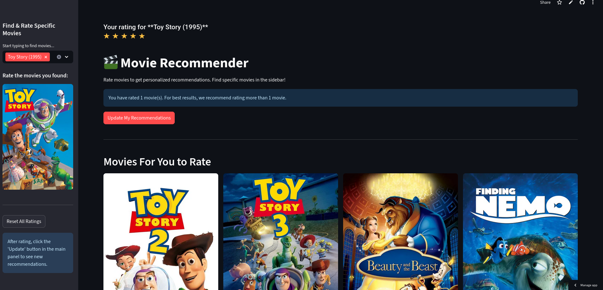

# 🎬 Personalized Movie Recommender System

A real-time, personalized movie recommender system built with Python and Streamlit. This application demonstrates how to solve the "cold start" problem by allowing a new user to rate movies and instantly receive tailored recommendations based on a pre-trained Alternating Least Squares (ALS) model.



---

## 🚀 Live Demo

**Interact with the live application here:**

[](https://movie-recommender-system-als.streamlit.app)

<br>

---

## ✨ Features

- **Real-time Personalization:** Get movie recommendations tailored to your taste, even as a brand new user.
- **Interactive Rating:** Rate movies using a simple and intuitive star-rating system.
- **Hybrid Interface:**
    - **Browse & Rate:** Rate movies directly from the recommendation grid.
    - **Search & Rate:** Find any specific movie from a catalog of over 60,000 to add to your ratings.
- **Dynamic UI:** The recommendation grid updates as you provide more ratings, creating an engaging user experience.
- **High-Performance Backend:** The original model was trained using Numba for C-speed calculations.

---

## 📂 Project Structure

This project is organized into several key files:

-   `model_training.ipynb`: A Jupyter Notebook containing all the code for training the Alternating Least Squares (ALS) model from the MovieLens 25M dataset.
-   `process-poster.py`: A Python script that queries The Movie Database (TMDb) API to fetch poster URLs for each movie.
-   `app.py`: The main Streamlit application file that loads the pre-trained model and serves the interactive user interface.
-   `artifacts/`: This directory stores the output of the model training—the final user/movie vectors and biases.
-   `data/`: This directory stores the raw and processed movie data, including the final `movies_with_posters.csv`.

---

## 🛠️ Setup and Installation

To run this application on your local machine, please follow these steps.

**1. Clone the repository:**
*(Replace `your-username` with your actual GitHub username)*
```bash
git clone https://github.com/your-username/movie-recommender-system.git
cd movie-recommender-system
```

**2. Create a Virtual Environment & Install Dependencies:**
```bash
# Create and activate a virtual environment
python -m venv venv
source venv/bin/activate  # On Windows, use `venv\Scripts\activate`

# Install required packages
pip install -r requirements.txt
```

**3. Download Model Artifacts with Git LFS:**
This project uses Git LFS (Large File Storage) for the model and data files.
```bash
# First-time setup for Git LFS
git lfs install

# Download the large model and data files
git lfs pull
```

---

## 🚀 Usage

Once the setup is complete, run the Streamlit app from your terminal:

```bash
streamlit run app.py
```
A new tab should open in your web browser with the application running.
