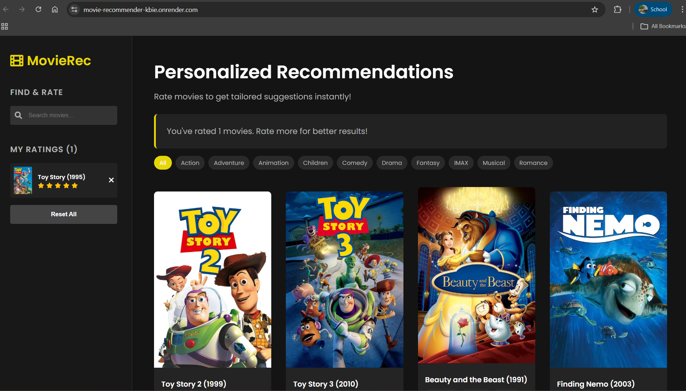

# 🎬 Personalized Movie Recommender Web App

A modern, real-time movie recommender system built with **Flask**, **HTML5/CSS3**, and **JavaScript**. This application uses a pre-trained Alternating Least Squares (ALS) model to provide personalized movie suggestions based on user ratings.

🔗 **Live demo:** [movie-recommender-kbie.onrender.com](https://movie-recommender-kbie.onrender.com)



## ✨ Features

-   **Modern Web UI:** A clean, light-themed interface with yellow accents.
-   **Real-time Personalization:** Instant recommendations based on your movie ratings.
-   **Live Search:** Search through a catalog of over 60,000 movies.
-   **Dynamic Updates:** The recommendation grid refreshes as you provide more feedback.
-   **Local Storage:** Your ratings are saved locally in your browser so you don't lose progress.
-   **Clean Architecture:** Separated frontend (Flask/JS) and backend (Python/Recommender Engine) logic.

## 📂 Project Structure

```text
movie-recommender-system/
├── app/                    # Web Application Frontend
│   ├── static/             # Static Assets (CSS, JS, Images)
│   │   ├── css/            # Stylesheets
│   │   └── js/             # Frontend Logic
│   └── templates/          # HTML Templates (Flask/Jinja2)
├── src/                    # Core Recommender Logic
│   └── recommender.py      # Recommendation Engine Class
├── artifacts/              # Pre-trained Model Artifacts (.npz, .pkl)
├── data/                   # Processed Dataset (CSV)
├── app.py                  # Flask Application Entry Point
└── requirements.txt        # Python Dependencies
```

## 🛠️ Setup and Installation

### 1. Clone the repository:
```bash
git clone https://github.com/your-username/movie-recommender-system.git
cd movie-recommender-system
```

### 2. Create a Virtual Environment & Install Dependencies:
```bash
# Create and activate a virtual environment
python -m venv venv
source venv/bin/activate  # On Windows, use `venv\Scripts\activate`

# Install required packages
pip install -r requirements.txt
```

### 3. Download Model Artifacts (Git LFS):
Ensure you have Git LFS installed to pull the model files.
```bash
git lfs install
git lfs pull
```

## 🚀 Usage

Run the Flask application from your terminal:

```bash
python app.py
```

Open your browser and navigate to `http://127.0.0.1:5000`.

## 🧠 How it Works

The system uses **Matrix Factorization** via the **Alternating Least Squares (ALS)** algorithm. 

1.  **Offline Training:** The model was trained on the MovieLens 25M dataset to generate user and movie vectors.
2.  **Online Inference:** When you rate movies, the app solves a small linear system in real-time to compute *your* user vector.
3.  **Ranking:** Your user vector is dotted with all movie vectors to predict scores, which are then ranked to provide recommendations.

---
Built with ❤️ for Movie Lovers.
